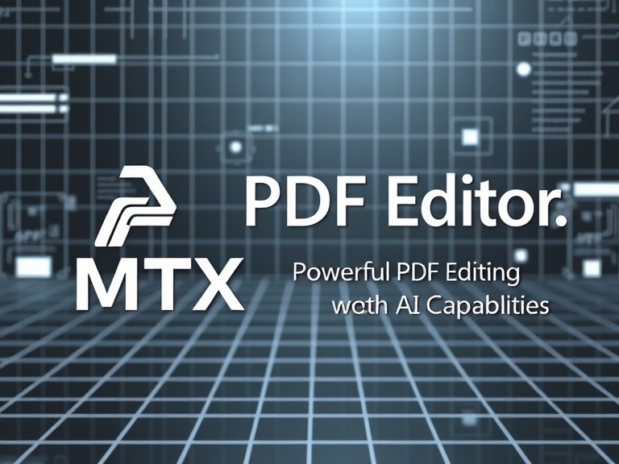

# 📝 MTX PDF Editor



**MTX PDF Editor** is a feature-rich, React-based PDF editor integrated with AI capabilities, designed specifically for VS Code. Whether you're editing, analyzing content, or extracting text, MTX PDF Editor offers a seamless and powerful experience. 

---

## 📌 Key Features


- **AI-Powered Text Extraction**: Extract text accurately with integrated AI capabilities.
- **PDF Editing Tools**: Edit PDF content directly within VS Code.
- **Thumbnail Navigation**: Quickly navigate through PDF pages using a thumbnail view.
- **Customizable Toolbar**: Easily access and modify tools for a tailored experience.

---

## 🚀 Installation Guide


1. Open the Extensions sidebar in VS Code.
2. Search for `MTX PDF Editor`.
3. Click **Install**.

Or use the following command in the VS Code Command Palette:
```bash
ext install MTX-Project.mtx-pdf-editor
```

---

## 📂 Opening a PDF with MTX PDF Editor


To open a PDF file:
1. Right-click on a `.pdf` file in your workspace.
2. Select **Open with MTX PDF Editor**.

Or, use the **Open MTX PDF Editor** command from the Command Palette.

---

## ⌨️ Keyboard Shortcuts


- **Ctrl+S**: Save PDF
- **Ctrl+K Ctrl+O**: Open a PDF document
- **Ctrl +** / **Ctrl -**: Zoom in and out

---

## 🤖 Using AI-Powered Features


Unlock powerful AI features like text analysis and content extraction:
1. Open a PDF and click on **Analyze Content with AI**.
2. Wait as the AI processes and extracts relevant data from the document.

---

## 🌟 Customizable Toolbar


Personalize your editing experience by customizing the toolbar to show only the tools you need.

---

## 🖼️ Thumbnail Navigation


Navigate through your PDF pages effortlessly using thumbnail previews on the sidebar.

---

## 🤝 Contributing

Contributions are welcome! See our [Contributing Guide](CONTRIBUTING.md) for more details on how to contribute to this project.

---

## 🧑‍💻 Author & Support

- **Author**: [MrTomXxX](https://github.com/MrT0mX)
- **GitHub**: [MTX PDF Editor](https://github.com/MTXPr0ject/mtx-pdf-editor)
- **Issues**: [Submit an Issue](https://github.com/MTXPr0ject/mtx-pdf-editor/issues)

For more details, visit our [Documentation](https://github.com/MTXPr0ject/mtx-pdf-editor#readme).
